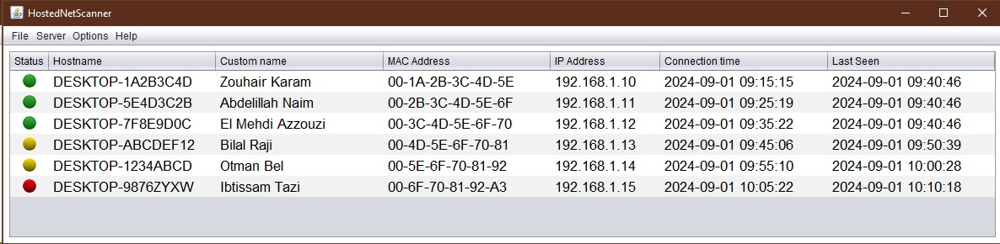

# HostedNetScanner

HostedNetScanner is a Java application designed to monitor devices connected to a Windows Hosted Network (a software-based Wi-Fi hotspot) in realtime. It provides a graphical user interface (GUI) to display connected devices, their status, and allows for customization of device names.  It also offers logging capabilities and configuration options for storing device information.  The application requires administrator privileges to function correctly.

## Table of Contents

- [Features](#features)
- [Prerequisites](#prerequisites)
- [Installation](#installation)
- [Usage](#usage)
- [Configuration](#configuration)
- [Dependencies](#dependencies)
- [Troubleshooting](#troubleshooting)
- [Contributing](#contributing)
- [License](#license)
- [Acknowledgments](#acknowledgments)

## Features

*   **Device Monitoring:** Displays a list of currently connected and previously connected devices to the hosted network.  Shows online, offline, and "unconfirmed" states.
*   **Status Indicators:** Uses visual icons (green, yellow, red) to represent the status of each device (online, unconfirmed, offline).
*   **Customizable Device Names:** Allows users to assign custom names to devices, making them easier to identify.  These names are persisted.
*   **Network Information:** Displays IP addresses, MAC addresses, connection times, and last seen times for each device.
*   **Hosted Network Management:** Provides options to start and stop the Windows Hosted Network directly from the application.
*   **Automatic Refresh:** Automatically updates the device list and status in real-time (every 2 seconds).
*   **Manual Refresh:**  Includes a "Refresh" button to manually update the device list.
*   **Configuration Window:** Allows users to specify the file paths for saving device logs and known device data.
*   **Network Settings Window:**  Allows users to configure the SSID and password for the hosted network.
*   **Logging:** Logs device connection information to a customizable file.  Logs application errors to an HTML log file.
*   **Sorting:**  Sorts devices in the table, prioritizing online devices and using IP addresses for ordering.
*   **ARP Scanning:** Uses ARP scanning to discover devices and resolve IP/MAC addresses.
*   **PowerShell Integration (Windows):**  Leverages PowerShell for more accurate device reachability checks (especially `Get-NetNeighbor`).

## Prerequisites

*   **Java Runtime Environment (JRE) 8 or higher:**  The application is built using Java and requires a compatible JRE to run.
*   **Windows Operating System:**  The application relies on Windows-specific commands (`netsh`, `ipconfig`, `arp`, and PowerShell) for network management and device discovery.  It is not compatible with other operating systems.
*   **Administrator Privileges:**  The application *must* be run with administrator privileges to access and manage the hosted network and perform network scans.

## Installation

1.  **Download:** Obtain the compiled JAR file (`HostedNetScanner.jar` - you'd need to create this from the provided code).  There is no installer; the application is a single executable JAR.
2.  **Place in a Suitable Location:**  Move the JAR file to a directory where you want to run the application from (e.g., `C:\Program Files\HostedNetScanner\`, or a folder on your Desktop).  This directory will also store the configuration files and logs.

## Usage

1.  **Run as Administrator:** Right-click on the `HostedNetScanner.jar` file (or its shortcut) and select "Run as administrator."  If you don't do this, the application will display an error message and exit.
2.  **Start the Hosted Network:** If your hosted network is not already running, use the "Server" -> "Start Hosted Network" menu option.  The application will prompt you for the network SSID and password (if not already configured).
3.  **View Connected Devices:**  The main window will display a table of connected devices.  The table updates automatically.
4.  **Stop the Hosted Network:**  To stop the hosted network, use the "Server" -> "Stop Hosted Network" menu option.
5.  **Refresh Manually:**  To force a refresh of the device list, use the "Server" -> "Refresh" menu option.
6.  **Configure Settings:** Use "Options" -> "Open Config" to change the file paths for logs and known devices.  Use "Server" -> "Network Settings" to change the hosted network's SSID and password.
7.  **Customize Device Names:**  Double-click on the "Custom name" column for a device in the table to enter a custom name.  Press Enter to save the name.
8. **Exit:** Close by going to `File -> Quit`.

## Configuration

The application stores its configuration using the Java Preferences API.  The settings are stored in the Windows Registry under `HKEY_CURRENT_USER\Software\JavaSoft\Prefs\hostednetscanner`.  You generally should *not* edit the registry directly; use the provided configuration windows within the application.

*   **Device Log File Path:**  The location where the device connection log is saved (default: `devicesStatus.txt` in the application directory).  This file contains a history of connected devices.
*   **Known Devices File Path:** The location where the list of known devices and their custom names are saved (default: `knownDevices.txt` in the application directory).
*   **Network Password:** The password for the hosted network.
*   **SSID:** The SSID (name) of the hosted network (default: "HostedNetScanner").

The application uses a simple file format (using `||` as a delimiter) for the `knownDevices.txt` file.  The `devicesStatus.txt` file is a plain text log file.  The `logs.html` file is an HTML file for error logging.

## Dependencies

*   **Java AWT/Swing:** Used for the graphical user interface.
*   **Java Preferences API:** Used for storing configuration settings.
*   **Java NIO:** Used for file watching (although the `WatchService` implementation is present but not fully utilized in the given code).
*   **Java Util Logging:** Used for basic logging (though a custom `Logger` class is implemented).

No external JAR libraries are required. All dependencies are part of the standard Java library.

## Troubleshooting

*   **"This application requires administrator privileges to run."**:  Make sure you are running the application as an administrator.
*   **No devices are showing up:**
    *   Ensure the hosted network is started.
    *   Ensure devices are actually connected to the hosted network.
    *   Try clicking the "Refresh" menu item.
    *   Check the `logs.html` file for any error messages.
*   **Sound notification doesn't work:** Ensure you have a `ding.wav` file in the application's directory.
*   **"Error setting the look and feel"**: This is likely a minor issue with the Nimbus look and feel.  The application should still function.  Check the `logs.html` file for details.
*   **Network not starting/stopping:**  Check the `logs.html` file for any errors related to `netsh wlan` commands.  Make sure no other software is interfering with the hosted network.
*   **PowerShell errors:** If you see errors related to PowerShell, ensure that PowerShell is installed and functioning correctly on your system.  The execution policy might need to be adjusted (though the code doesn't explicitly handle this).

## Contributing

Contributions are welcome! If you find any bugs or have suggestions for improvements, please open an issue or submit a pull request. Please follow these guidelines:

1.  **Fork the repository.**
2.  **Create a new branch:** `git checkout -b feature/your-feature-name`
3.  **Make your changes.**
4.  **Commit your changes:** `git commit -m "Add some feature"`
5.  **Push to the branch:** `git push origin feature/your-feature-name`
6.  **Submit a pull request.**

## License

This project is licensed under the ISC License - see the [LICENSE](LICENSE) file for details.

## Acknowledgments

*   This project uses the Java Preferences API for storing configuration data.
*   It leverages Windows `netsh`, `ipconfig`, `arp`, and PowerShell commands for network management.
